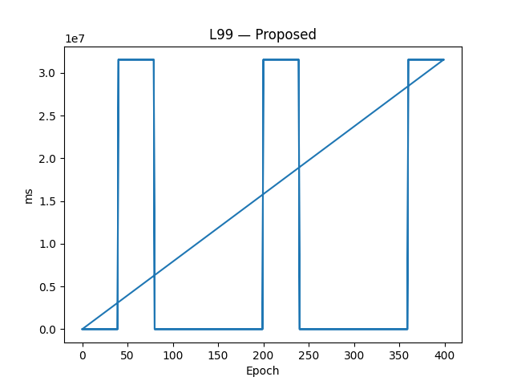

Requires: Python 3.11+ (tested on 3.11/3.12/3.13)

## Quick links
- ▶️ **Colab (minimal notebook):** `notebooks/00_colab_minimal.ipynb`
- 📊 **Summary CSV:** `data/outputs/table_main.csv`
- 📈 **Figures:** `data/outputs/l99_Proposed.png`, `data/outputs/risk_Proposed.png`

## Sample results



[](https://colab.research.google.com/github/YassirALKarawi/dt-gate-6g/blob/main/notebooks/00_colab_minimal.ipynb)
[](LICENSE)


# AI-Enabled Digital Twin Gate for Secure & Resilient 6G (Simulation Stack)

This repository provides a Python-only simulation of the paper's control loop:
EKF/NIS-based trust (τ), queueing tail (Kingman) + Cantelli reliability, a
tube-tightening margin, risk scoring with isotonic calibration + randomized
smoothing and CVaR, and a simplified optimizer (projected search) that collectively
emulate the DT-gated orchestration loop.

> **Note**: This is a Python replica (no ns-3/srsRAN). It is structured to accept
real telemetry later (socket/JSON), so you can plug in your ns-3 bridge when ready.

## Quickstart
```bash
# (recommended) create venv
python -m venv .venv && source .venv/bin/activate
pip install -r requirements.txt

# run a default simulation (700 epochs, 5 seeds)
python -m src.dt_gate.simulate --epochs 700 --seeds 1 2 3 4 5 --variant Proposed

# generate figures/tables from outputs
python scripts/make_figs.py --inputs data/outputs/*.csv --outdir data/outputs
```

Outputs: `data/outputs/table_main.csv` + PNG figures.

## Project layout
```
dt-gate-6g/
├─ README.md
├─ LICENSE
├─ requirements.txt
├─ pyproject.toml              # optional (you can delete if using requirements only)
├─ .gitignore
├─ .pre-commit-config.yaml
├─ .github/workflows/ci.yml
├─ src/dt_gate/
│  ├─ __init__.py
│  ├─ config.py
│  ├─ queueing.py
│  ├─ ekf.py
│  ├─ tube.py
│  ├─ risk.py
│  ├─ optimizer.py
│  ├─ telemetry.py
│  └─ simulate.py
├─ scripts/make_figs.py
├─ data/outputs/
└─ notebooks/00_colab_minimal.ipynb
```

## Citation
If this repository helps your research, please cite the paper or this codebase.
A `CITATION.cff` can be added later when a DOI is minted (e.g., via Zenodo).

## License
MIT (see LICENSE).
